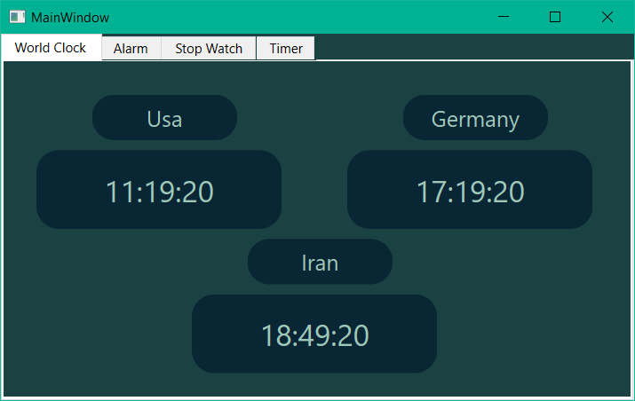
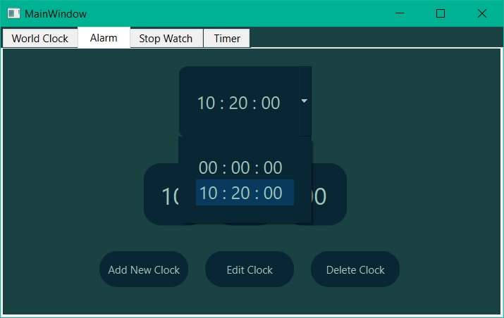
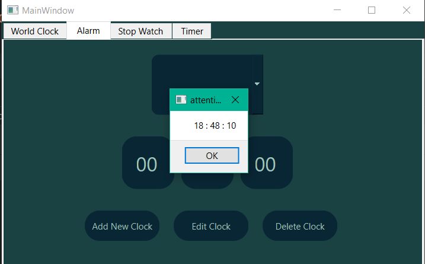
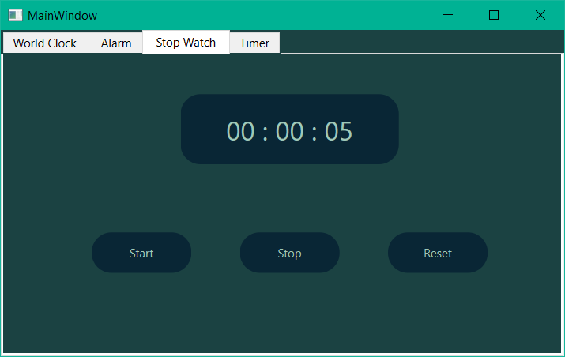
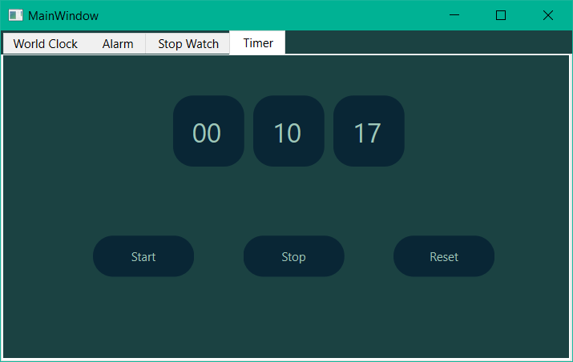

# Time App:

---

this app have four section: 
-   world clock
-   alarm
-   stopwatch
-   timer

---

world clock:

this section have Usa, Germany and Iran live Clock.

---

alarm:

in this section you can add time for alarm. also you can edit or delete time.

add time app show alarm for you

---

stopwatch:

in this section you can start time, stop and reset for check time for anything.

---

Timer: 

in this section you cat set custom timer. also you can stop or start time.

