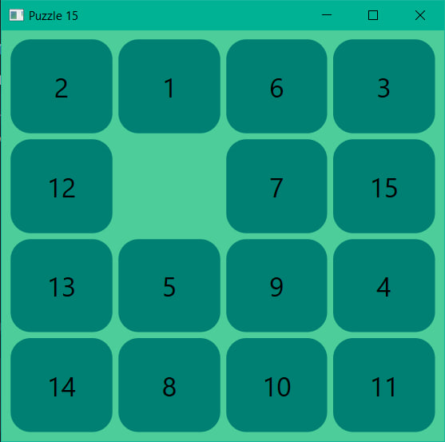
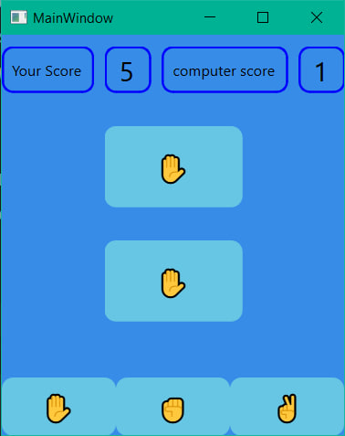
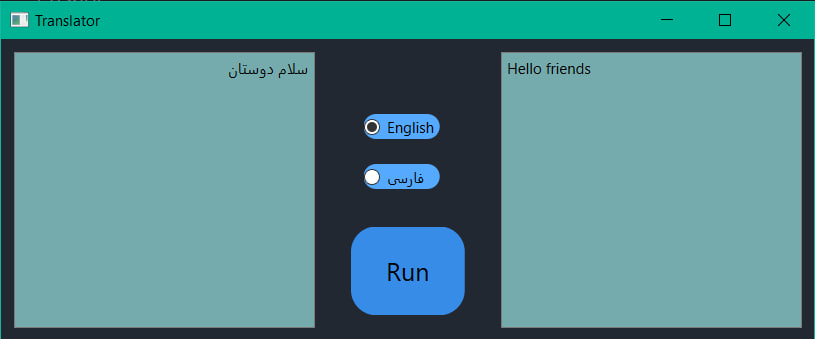
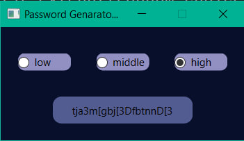

<h1 style="text-align: center;">Puzzle 16</h1>



<h3 style="text-align: center;">15 simple and attractive puzzle game.</h3>

<h3 style="text-align: center;">The goal of the game is to sort the numbers by moving the houses.</h3>

<hr>

<h1 style="text-align: center;">Paper Rock Scissors</h1>




<h3 style="text-align: center;">The old game of rock paper scissors</h3>

<h3 style="text-align: center;">To play, just click on the stone or paper or scissors.</h3>

<hr>


<h1 style="text-align: center;">Translator</h1>




<h3 style="text-align: center;">Text translation program</h3>

<h3 style="text-align: center;">Enter your text to translate and enter your desired language.</h3>

<hr>


<h1 style="text-align: center;">Password Generator</h1>




<h3 style="text-align: center;">Random password generation program</h3>

<h3 style="text-align: center;">Random password generation program
To create a password, just select the difficulty of the password</h3>

<hr>

To get started, you need to install the pyside6 and googletrans library

```
pip install pyside6
pip install googletrans==4.0.0-rc1
```