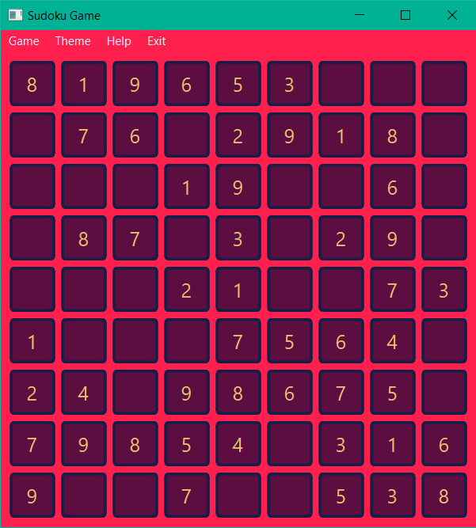
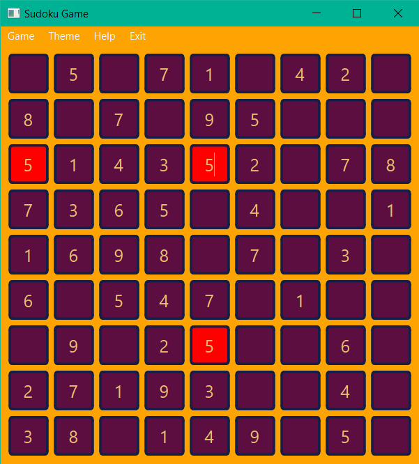
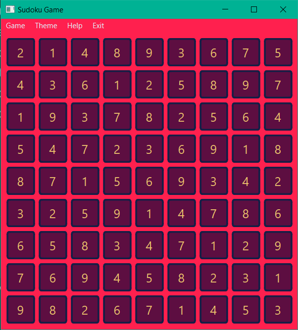
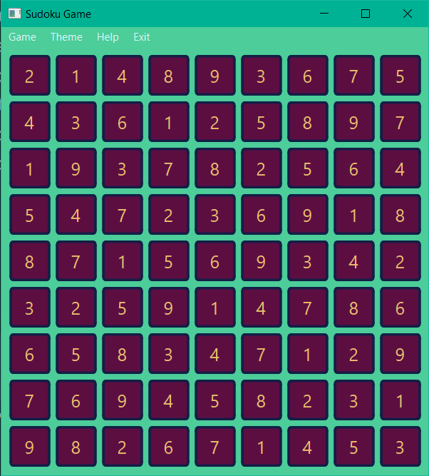
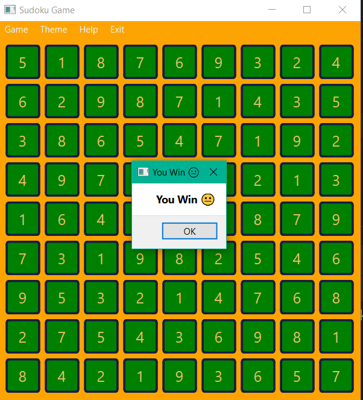

# Sudoku Game



Try to fill all the houses in the table and win.

This program has three different theme.

Ability to load table from a text file.

Along with the guide and answer.

Run the dist/main.exe file to run.

To run the first program, you need to install the following library.

```
pip install pyside6
```

Pictures of the game environment:







