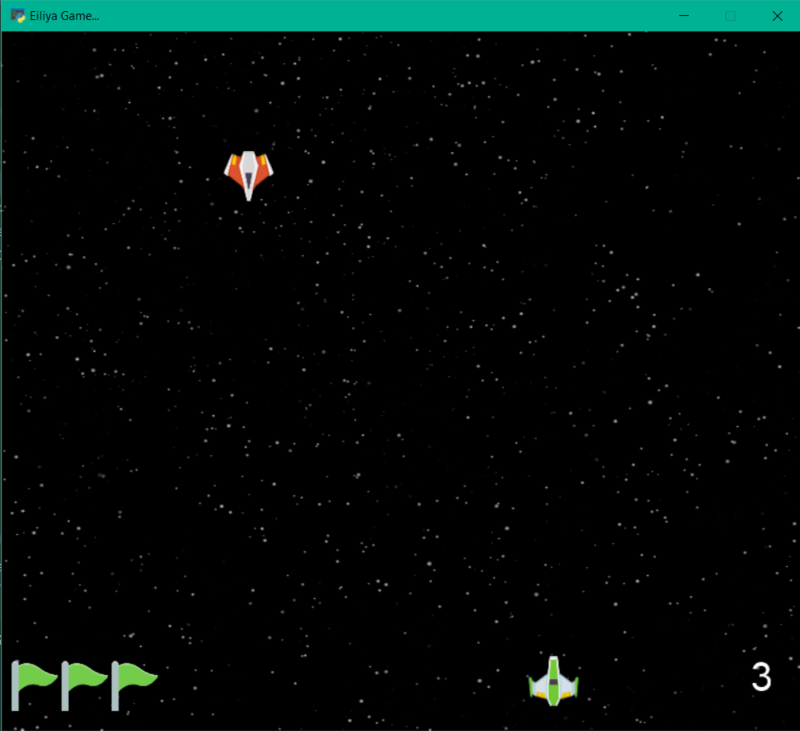

# Interstellar Game with Threading

In this program, threading is used to create enemies

An attractive game for entertainment and leisure.

---


| Game instructions |                                    |
|-------------------|------------------------------------|
| move to right     | select arrow key right or select D |
| move to left      | select arrow key left or select A  |  
| fire              | select space                       |

##### If the enemies cross the finish line, you will lose one of your flags.
##### If you lose all the flags, you lose the game.
##### If you encounter enemies, you will lose the game.
##### By eliminating enemies by shooting them, your score will increase.
##### During the game, the speed of the enemies increases gradually.

To get started, you need to install the Arcade library
```
 pip install arcade
```

Run the following file to run the program.
```
python interrstellar.py
```
