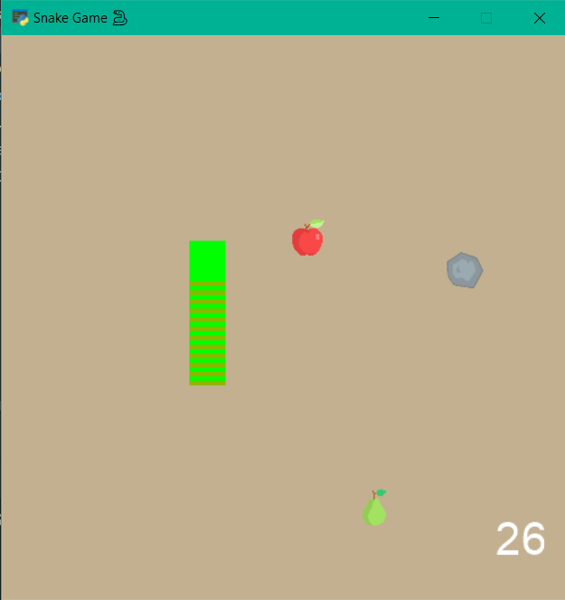

# Snake Game

An attractive game for entertainment and leisure.

---


| Game instructions |                        |
|-------------------|------------------------|
| move to right     | select arrow key right |
| move to left      | select arrow key left  |  
| move to up        | select arrow key up    |
| move to down      | select arrow key down  |

##### If the snake leaves the screen, you lose.

##### If the snake hits its own body, you lose.

##### You get one point by eating an apple, two points by eating a pear, and you lose one point by eating a stone.


To get started, you need to install the Arcade library

```
 pip install arcade
```